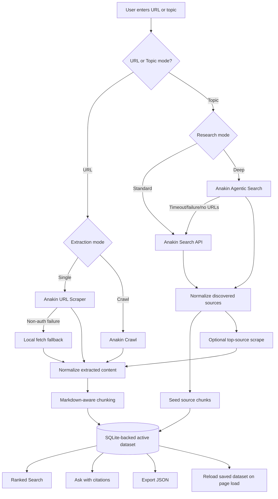

<h1 align="center">Web2Knowledge - AI Research Dataset Builder</h1>

Web2Knowledge is a Node.js and Express product that turns a public URL or research topic into a persistent, searchable, AI-ready knowledge base using Anakin APIs, local fallback extraction, and SQLite storage.

The app supports URL scraping, limited site crawling, topic research, optional Agentic Search with fallback, ranked local search, extractive Q&A with citations, saved datasets, and JSON export for downstream AI/RAG workflows.

## Live Demo
[Launch Web2Knowledge](https://web2knowledge.onrender.com/)


--- 

## Current Features

- URL mode for direct public page extraction.
- Site Crawl mode for limited multi-page extraction from a URL.
- Topic mode using Anakin Search API for source discovery.
- Deep Research mode using Anakin Agentic Search, with automatic Standard Search fallback.
- Local URL fetch fallback when Anakin URL scraping has a transient non-auth failure.
- Markdown-aware chunking by headings and paragraphs.
- SQLite persistence in `data/web2knowledge.sqlite`.
- Saved dataset hydration on page load.
- Ranked local search with stopword filtering and light token normalization.
- Ask endpoint that returns extractive answers with citations.
- Low-confidence guard for unrelated questions.
- Clear Dataset action.
- Downloadable JSON export.
- Product-style UI with local CSS, tabs, guide, workspace, source cards, and ask panel.
- Deployment-ready Render config.

---

## Product Flow



---

## Tech Stack

## Backend

- Node.js
- Express.js
- Axios
- dotenv
- Node built-in SQLite via `node:sqlite`

## Frontend

- Plain HTML
- Local CSS in `public/styles.css`
- Vanilla JavaScript in `public/app.js`
- No frontend build step
- No Tailwind CDN dependency

## External APIs

- Anakin URL Scraper
- Anakin Crawl
- Anakin Search API
- Anakin Agentic Search API

---

## Setup

1. Install dependencies:

```powershell
npm.cmd install
```

2. Create `.env`:

```env
ANAKIN_API_KEY=your_active_anakin_api_key
PORT=3000
```

3. Start the app:

```powershell
npm.cmd start
```

4. Open:

```text
http://localhost:3000
```

For development with reload:

```powershell
npm.cmd run dev
```

---

## Tests

Run:

```powershell
npm.cmd test
```

Current coverage: `23` tests.

The automated suite does not call Anakin live. It covers:

- Homepage route.
- Static frontend assets.
- Health route.
- Export headers and JSON shape.
- Exported chunk metadata.
- Dataset clearing.
- SQLite persistence.
- Missing input validation.
- Missing topic validation.
- Search endpoint behavior.
- Ranked token matching.
- Ask endpoint validation.
- Ask answers with citations.
- Guarding against unrelated questions.
- URL validation.
- Markdown-aware chunking.
- Search result normalization.
- Citation extraction.
- Research summary extraction.

---

## Manual Real-World Test Flow

## URL Build

1. Click `Clear Dataset`.
2. Enter:

```text
https://developer.mozilla.org/en-US/docs/Web/JavaScript
```

3. Select:

```text
URL
Single
Standard
```

4. Click `Build Knowledge Base`.
5. Search:

```text
javascript
```

6. Ask:

```text
What is JavaScript?
```

Expected:

- Build succeeds.
- Chunks are created.
- Search returns results.
- Ask returns an answer with citations.

## Topic Build

1. Click `Clear Dataset`.
2. Enter:

```text
REST API design best practices
```

3. Select:

```text
Topic
Standard
```

4. Click `Build Knowledge Base`.
5. Search:

```text
api
```

6. Ask:

```text
What are REST API best practices?
```

Expected:

- Sources are discovered.
- Chunks are created.
- Ask returns citations from the active dataset.

## Negative Ask Check

After building a JavaScript dataset, ask:

```text
What are AI agents?
```

Expected:

```text
I could not find matching context in the current knowledge base.
```

---

## API Endpoints

## `GET /health`

Returns service status.

```json
{
  "status": "ok",
  "project": "Web2Knowledge"
}
```

## `POST /api/build`

Builds the active dataset from a URL. If the input is not a URL, the server routes it to topic research.

Payload:

```json
{
  "input": "https://tailwindcss.com/docs",
  "mode": "url",
  "extractionMode": "scrape",
  "researchMode": "standard"
}
```

For crawl:

```json
{
  "input": "https://tailwindcss.com/docs",
  "mode": "url",
  "extractionMode": "crawl",
  "researchMode": "standard"
}
```

## `POST /api/topic-build`

Builds the active dataset from a topic.

Payload:

```json
{
  "input": "AI agents for software development",
  "mode": "topic",
  "researchMode": "standard"
}
```

For Deep Research:

```json
{
  "input": "AI agents for software development",
  "mode": "topic",
  "researchMode": "agentic"
}
```

Agentic Search may time out and fall back to Standard Search. This is expected behavior.

## `GET /api/search`

Returns the current saved chunks when no query is provided:

```text
/api/search
```

Searches ranked chunks when `q` is provided:

```text
/api/search?q=installation
```

## `POST /api/ask`

Answers a question from the active dataset using retrieved chunk context.

Payload:

```json
{
  "question": "What is Tailwind CSS?"
}
```

Response includes:

- `answer`
- `citations`
- `totalContextChunks`

## `GET /api/export`

Downloads the active dataset as:

```text
web2knowledge-dataset.json
```

Shape:

```json
{
  "project": "Web2Knowledge",
  "generatedAt": "2026-05-16T00:00:00.000Z",
  "totalChunks": 0,
  "data": []
}
```

## `DELETE /api/dataset`

Clears the active dataset from memory and SQLite.

Response:

```json
{
  "success": true,
  "totalChunks": 0
}
```

---

## Data Model

Each chunk is stored as:

```json
{
  "id": "string",
  "title": "string",
  "source": "string",
  "content": "string",
  "chunkIndex": 0,
  "generatedJson": {}
}
```

Chunks are held in memory while the server runs and saved to SQLite at:

```text
data/web2knowledge.sqlite
```

The SQLite database is ignored by git.

---

## Frontend Structure

```text
public/
  index.html    App shell and semantic markup
  styles.css    Local product styling
  app.js        Browser state, API calls, rendering
```

The UI includes:

- Top product header.
- Build/Workspace/Ask/Guide tabs.
- Dataset stats.
- Build sidebar.
- Ask panel.
- Status/progress panel.
- Workspace tabs for Results, Sources, and Summary.
- User Guide with real-world examples.

---

## Reliability Notes

- URL scraping and crawl jobs are async and use polling.
- Agentic Search jobs are async and use polling.
- Agentic Search can fall back to Standard Search.
- Topic mode seeds chunks from discovered source metadata before optional scraping.
- Topic source scraping uses a short timeout so builds stay responsive.
- Direct URL builds can fall back to local fetch on non-auth Anakin scrape failures.
- Auth failures do not use local fallback, so bad API keys are visible.
- Ask uses a low-confidence guard to avoid answering unrelated questions from weak matches.
- Saved chunks reload on page load.

---

## Deployment

## Render

1. Push the project to GitHub.
2. Create a Render Web Service.
3. Use:

```text
Build Command: npm install
Start Command: npm start
```

4. Add:

```text
ANAKIN_API_KEY=your_active_anakin_api_key
```

The included `render.yaml` can be used as a Render blueprint.

---

## Future Scope

- Project history with multiple saved datasets.
- Real vector embeddings and semantic search.
- LLM-backed RAG chat.
- Background queue for long crawls.
- Source quality scoring.
- Source deduplication.
- Scheduled refreshes.
- Export presets for LangChain, LlamaIndex, Pinecone, Supabase, and LanceDB.
