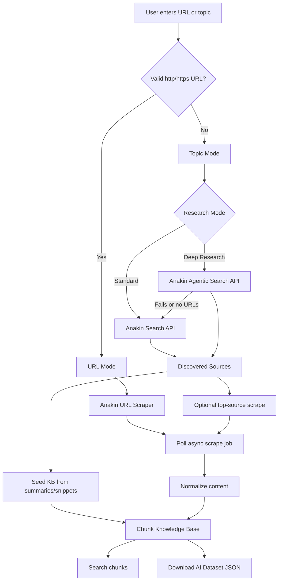
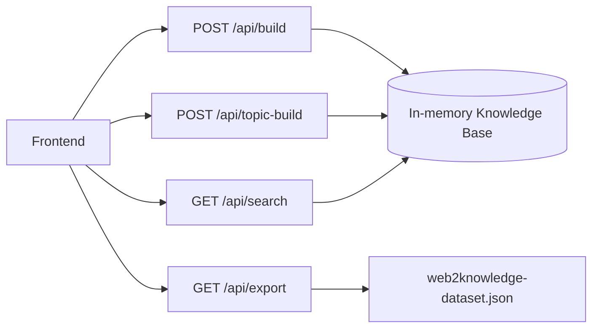

# Web2Knowledge - AI Research Dataset Builder

Web2Knowledge is a lightweight Node.js and Express app that turns a public URL or research topic into a searchable, AI-ready knowledge base using Anakin APIs.

The app supports direct URL scraping, topic-based web research, optional Agentic Search, local keyword search, and downloadable JSON export for RAG or AI dataset workflows.

## Public Link: rag and ai agent dataset generation
---

## What It Does

- Scrapes a public `http` or `https` URL with Anakin URL Scraper.
- Optionally crawls a small site sample with Anakin Crawl for multi-page extraction.
- Handles Anakin's async scrape jobs by polling until completion.
- Accepts plain-language topics such as `Next.js routing`.
- Uses Anakin Search API to discover relevant sources for topics.
- Optionally uses Anakin Agentic Search for deeper research, summaries, and citations.
- Falls back from Agentic Search to Standard Search if Agentic Search fails.
- Chunks extracted or discovered content into a local in-memory knowledge base.
- Searches generated chunks from the frontend.
- Downloads the current dataset as `web2knowledge-dataset.json`.
- Preserves Anakin `generatedJson` metadata on chunks when available.

---

## Current MVP Features

- URL mode for direct page scraping.
- Site Crawl mode for limited multi-page extraction from a URL.
- Topic Search mode for source discovery and fast research.
- Deep Research mode using Anakin Agentic Search.
- Research summary display when available.
- Discovered source cards with citations when available.
- Fast topic mode that seeds chunks from search results and only attempts a short full scrape for the top source.
- Searchable chunk results with source links.
- Downloadable AI dataset JSON export.
- Deployment-ready config for Render-style hosting.

---

## Product Flow



---

## Tech Stack

## Backend

- Node.js
- Express.js
- Axios
- dotenv

## Frontend

- Plain HTML
- Tailwind CSS CDN
- Vanilla JavaScript

## Anakin APIs

- URL Scraper
- Search API
- Agentic Search API

---

## Setup

1. Install dependencies:

```powershell
npm install
```

2. Create `.env`:

```env
ANAKIN_API_KEY=your_active_anakin_api_key
PORT=3000
```

3. Start the dev server:

```powershell
npm run dev
```

4. Open:

```text
http://localhost:3000
```

---

## Tests

Run the local test suite:

```powershell
npm test
```

The tests use Node's built-in test runner and do not call Anakin live. They cover:

- Homepage route.
- Health route.
- Export download headers and JSON shape.
- Exported chunk metadata.
- Missing input validation.
- Missing topic validation.
- Search endpoint behavior.
- URL validation.
- Chunking.
- Search-result normalization.
- Citation extraction.
- Research summary extraction.

---

## Usage

## Direct URL

Enter a URL:

```text
https://tailwindcss.com/docs
```

The backend calls Anakin URL Scraper, polls the async job, extracts Markdown, chunks it, and stores it in memory.

Select `Site Crawl` to use Anakin Crawl for a small multi-page sample from the same URL.

## Topic Search

Enter a topic:

```text
Next.js routing
```

The backend uses Anakin Search API to discover sources, validates `http` and `https` URLs, creates initial chunks from search snippets, and optionally scrapes the top source for richer content.

## Deep Research

Select:

```text
Deep Research (Agentic)
```

The backend tries Anakin Agentic Search first, extracts summaries, citations, and source URLs, then builds the knowledge base. If Agentic Search fails or returns no valid URLs, the app falls back to Standard Search automatically.

---

## Deployment

The repo is ready for public hosting.

## Render

1. Push this project to GitHub.
2. Create a new Render Web Service from the GitHub repo.
3. Use:

```text
Build Command: npm install
Start Command: npm start
```

4. Add environment variable:

```text
ANAKIN_API_KEY=your_active_anakin_api_key
```

The included `render.yaml` can also be used as a Render blueprint.

---

## API Endpoints



## `GET /health`

Returns basic project health.

## `POST /api/build`

Builds a knowledge base from a URL. If plain text is provided, the backend auto-routes it to topic research.

Payload:

```json
{
  "input": "https://tailwindcss.com/docs",
  "mode": "url",
  "researchMode": "standard"
}
```

## `POST /api/topic-build`

Builds a knowledge base from a topic using Standard Search or Agentic Search.

Payload:

```json
{
  "input": "Next.js routing",
  "mode": "topic",
  "researchMode": "agentic"
}
```

## `GET /api/search?q=tailwind`

Searches the in-memory knowledge base.

## `GET /api/export`

Downloads the current dataset as:

```text
web2knowledge-dataset.json
```

Export structure:

```json
{
  "project": "Web2Knowledge",
  "generatedAt": "2026-05-10T00:00:00.000Z",
  "totalChunks": 0,
  "data": []
}
```

---

## Data Model

Each chunk is stored in memory as:

```json
{
  "id": "string",
  "title": "string",
  "source": "string",
  "content": "string",
  "chunkIndex": 0,
  "generatedJson": {}
}
```

---

## Reliability Notes

- URL scraping is async and uses polling.
- Crawl jobs are async and use polling.
- Topic input is never sent directly to the URL Scraper.
- Invalid URLs are filtered before scraping.
- Topic mode limits valid discovered sources to keep demos fast.
- Slow topic source scrapes are skipped instead of failing the full build.
- Agentic Search gracefully falls back to Standard Search.
- Site Crawl is optional so demos can choose speed or broader extraction.

---

## Future Scope

- Vector embeddings and semantic search.
- RAG chat interface.
- Dataset persistence.
- Scheduled refreshes.
- Source-level quality scoring.
- Export formats for LangChain, LlamaIndex, Pinecone, Supabase, or LanceDB.
