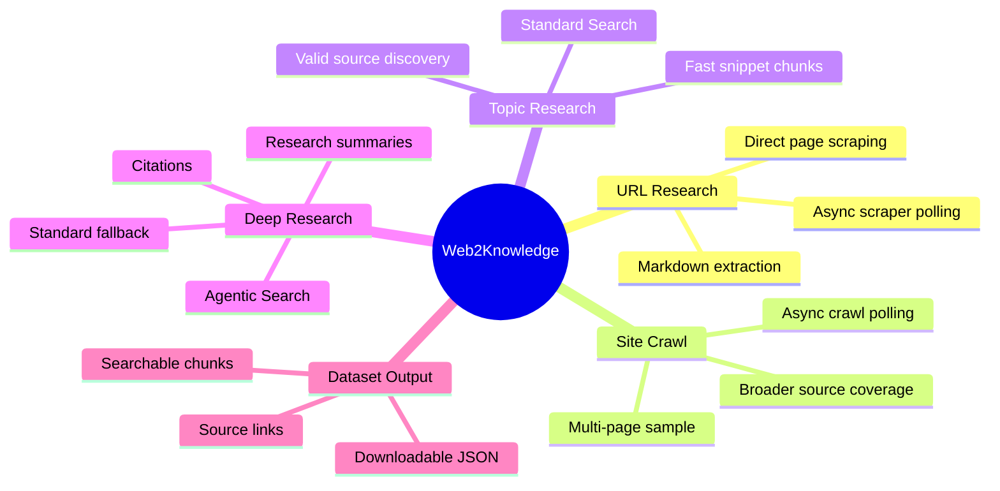
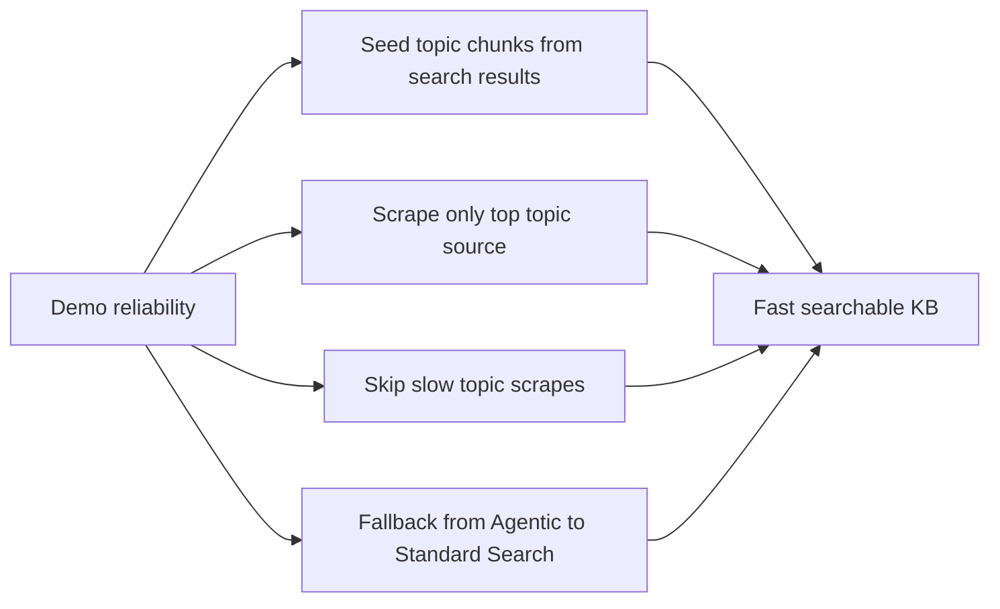

# Web2Knowledge - Ideation and Concept Development

## Project Context

Web2Knowledge is an AI research dataset builder that converts public URLs and open-ended topics into searchable, AI-ready knowledge chunks.

The project started as a universal web-to-knowledge pipeline and evolved into a demo-ready research product with three practical modes:

- Direct URL scraping.
- Limited site crawling.
- Standard topic search.
- Deep Research using Agentic Search.

The goal is to make public web knowledge usable for AI assistants, RAG systems, research workflows, and developer tooling without adding heavy infrastructure.

---

## Problem

Developers, researchers, and AI builders often need to turn public web content into structured datasets. The manual workflow is slow:

- Find relevant sources.
- Open each page.
- Copy useful content.
- Remove noise.
- Split text into chunks.
- Preserve source links.
- Export to JSON or a RAG pipeline.

Documentation sites, blogs, and public articles are useful, but their content is scattered across pages and stored in noisy HTML.

---

## Selected Solution

Web2Knowledge solves this by combining Anakin APIs with a small Node.js processing layer.

The system:

1. Accepts either a direct URL or a topic.
2. Uses Anakin Search or Agentic Search to discover sources for topics.
3. Uses Anakin URL Scraper for direct URL extraction and optional source enrichment.
4. Uses Anakin Crawl for optional limited multi-page extraction.
5. Converts content into normalized chunks with generated JSON metadata when available.
6. Stores chunks in memory for fast local search.
7. Exports the current knowledge base as downloadable JSON.

---

## Why This Direction

Other explored ideas included:

- Price intelligence.
- Job aggregation.
- SEO research.
- Content monitoring.
- AI dataset generation.

Web2Knowledge was chosen because it demonstrates a broad, reusable workflow:

- Research discovery.
- Web extraction.
- AI-ready cleaning.
- Searchable chunking.
- Dataset export.

This makes the product useful beyond one narrow domain.

---

## Core Product Idea

The product should feel like a simple AI research workbench:

- Paste a URL for direct extraction.
- Type a topic for web research.
- Toggle Deep Research when a richer summary and citations are needed.
- Search the generated knowledge base.
- Download the dataset.

The product is intentionally lightweight: no database, no auth, no React, and no vector store in the MVP.

---

## Anakin Integration Strategy

## URL Scraper

Used for direct page extraction.

Important behavior:

- The scraper returns async jobs.
- The backend must poll `GET /url-scraper/{jobId}` until completion.
- The app validates URLs before sending them to the scraper.
- `generatedJson` metadata is preserved on exported chunks when available.

## Crawl

Used for optional multi-page URL extraction.

Important behavior:

- The app submits a crawl job to Anakin.
- The backend polls the crawl job until completion.
- Crawl is limited in the MVP so demos remain fast.

## Search API

Used for Standard Topic Search.

Important behavior:

- The API expects a prompt-like query payload.
- Search results may be nested, so the backend recursively extracts valid URLs.
- Topic mode builds fast initial chunks from search titles, snippets, and source links.

## Agentic Search

Used for optional Deep Research mode.

Important behavior:

- The app calls Agentic Search only when selected.
- It extracts source URLs, citations, and a research summary when available.
- If Agentic Search fails, the app falls back to Standard Search.

---

## MVP Product Decisions

The MVP prioritizes speed and demo reliability.

Key decisions:

- Store chunks in memory.
- Use keyword search instead of vector search.
- Limit topic scraping to avoid long waits.
- Seed topic knowledge bases from search results immediately.
- Skip slow topic source scrapes instead of failing the entire build.
- Keep URL mode as the full scrape path.
- Add optional Crawl mode for broader URL coverage when judges want to see crawling.

---

## User Value

Web2Knowledge helps users:

- Build AI-ready datasets quickly.
- Research topics without manually opening multiple sources.
- Preserve source URLs for traceability.
- Search extracted content locally.
- Export structured JSON for downstream AI workflows.

---

## Future Opportunities

- Semantic search with embeddings.
- RAG chatbot over generated chunks.
- Persistent project history.
- Source scoring and deduplication.
- Scheduled refreshes for changing documentation.
- Export templates for LangChain and LlamaIndex.
- Vector database integrations.

---

## Concept Summary

Web2Knowledge turns messy public web content into structured, searchable, exportable knowledge. It uses Anakin for discovery and extraction while keeping the app architecture simple enough to understand, demo, and extend.
