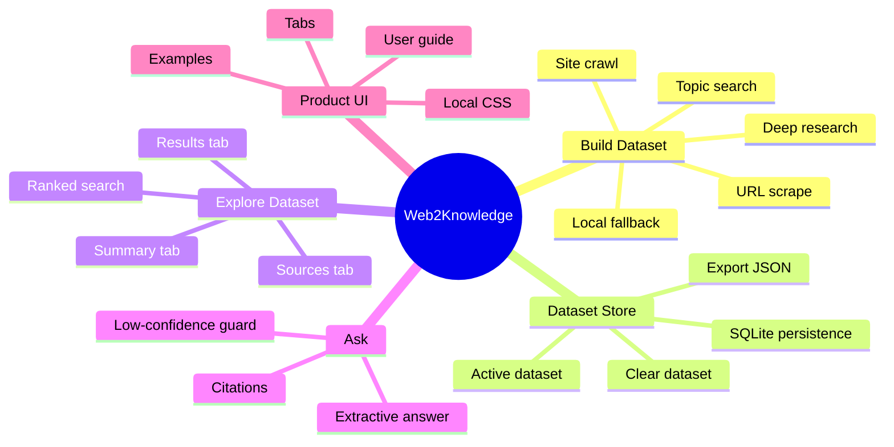
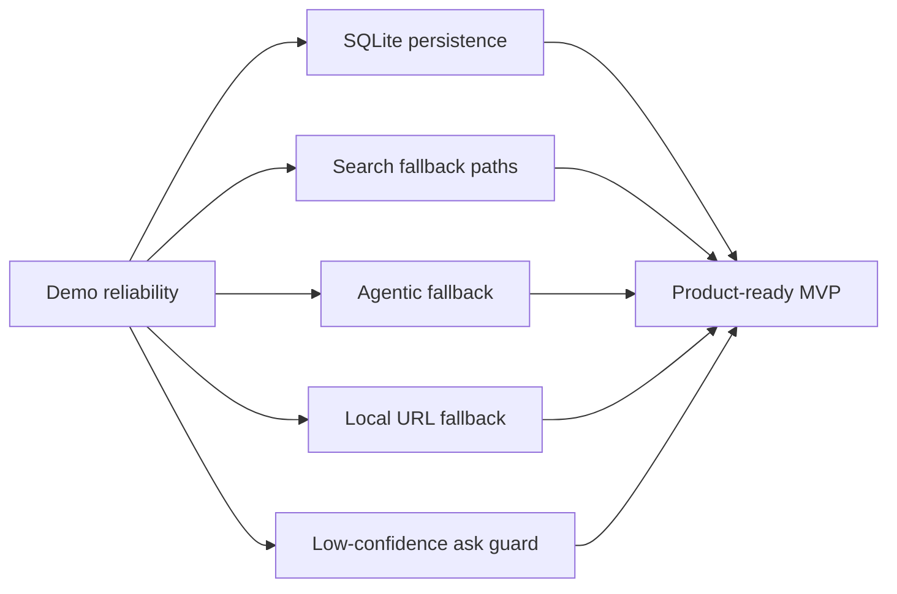

# Web2Knowledge - Ideation and Concept Development

## Project Context

Web2Knowledge is an AI research dataset builder that converts public URLs and open-ended topics into searchable, persistent, AI-ready knowledge chunks.

The product has evolved from a simple web-to-knowledge demo into a lightweight research workspace with:

- Direct URL scraping.
- Limited site crawling.
- Standard topic search.
- Deep Research using Agentic Search with fallback.
- SQLite-backed dataset persistence.
- Ranked local search.
- Extractive ask with citations.
- JSON export.
- Product-style UI with tabs and a built-in user guide.

The goal is to make public web knowledge usable for AI assistants, RAG systems, research workflows, and developer tooling without adding heavy infrastructure.

---

## Problem

Developers, researchers, and AI builders often need to turn public web content into structured datasets. The manual workflow is slow:

- Find relevant sources.
- Open each page.
- Copy useful content.
- Remove noise.
- Split text into chunks.
- Preserve source links.
- Search the extracted material.
- Ask questions over the material.
- Export to JSON or a RAG pipeline.

Documentation sites, blogs, and public articles are useful, but their content is scattered across pages and stored in noisy HTML.

---

## Selected Solution

Web2Knowledge combines Anakin APIs with a small Node.js processing and product layer.

The system:

1. Accepts either a direct URL or a topic.
2. Uses Anakin Search or Agentic Search to discover topic sources.
3. Uses Anakin URL Scraper for direct URL extraction and optional source enrichment.
4. Uses Anakin Crawl for optional limited multi-page extraction.
5. Falls back to local URL fetch for non-auth direct scrape failures.
6. Converts content into normalized chunks with generated JSON metadata when available.
7. Persists chunks to SQLite.
8. Searches the active dataset with ranked local retrieval.
9. Answers questions with citations from retrieved chunks.
10. Exports the current knowledge base as downloadable JSON.

---

## Why This Direction

Other explored ideas included:

- Price intelligence.
- Job aggregation.
- SEO research.
- Content monitoring.
- AI dataset generation.

Web2Knowledge was chosen because it demonstrates a broad, reusable workflow:

- Research discovery.
- Web extraction.
- AI-ready cleaning.
- Persistent dataset storage.
- Searchable chunking.
- Question answering.
- Dataset export.

This makes the product useful beyond one narrow domain.

---

## Current Product Shape

The product should feel like a focused AI research workbench:

- Paste a URL for direct extraction.
- Type a topic for web research.
- Toggle Deep Research when a richer agentic attempt is useful.
- Search the generated knowledge base.
- Ask questions grounded in the active dataset.
- Export the dataset.
- Clear and rebuild quickly.
- Learn the workflow from the built-in guide.

The product remains intentionally lightweight:

- No frontend framework.
- No separate build step.
- No auth yet.
- No vector database yet.
- SQLite is used for a single active saved dataset.

---

## Anakin Integration Strategy

## URL Scraper

Used for direct page extraction.

Important behavior:

- The scraper can return async jobs.
- The backend polls until completion.
- The app validates URLs before sending them to Anakin.
- `generatedJson` metadata is preserved on exported chunks when available.
- Direct scrape non-auth failures can fall back to local fetch.

## Crawl

Used for optional multi-page URL extraction.

Important behavior:

- The app submits a crawl job to Anakin.
- The backend polls the crawl job until completion.
- Crawl is limited so demos remain fast.

## Search API

Used for Standard Topic Search.

Important behavior:

- The API receives a prompt/query payload.
- Search results may be nested, so the backend recursively extracts valid URLs.
- Topic mode builds fast initial chunks from source titles, snippets, and links.
- The top source may be scraped for richer context.

## Agentic Search

Used for optional Deep Research mode.

Important behavior:

- Agentic Search is called only when selected.
- It may return async jobs.
- It may time out.
- If it fails, times out, or returns no valid URLs, the app falls back to Standard Search.

---

## Product Decisions

The current product prioritizes reliability, clarity, and demo speed.

Key decisions:

- Keep one active dataset instead of multi-project history.
- Persist the active dataset to SQLite.
- Keep search local and deterministic for now.
- Use extractive ask instead of requiring another LLM dependency.
- Add a low-confidence guard so unrelated questions do not get misleading answers.
- Seed topic builds from discovered source metadata immediately.
- Scrape only the top topic source by default.
- Use local direct-URL fallback only for non-auth scrape failures.
- Keep frontend static, maintainable, and framework-free.
- Use local CSS instead of relying on a CDN for layout.

---

## User Value

Web2Knowledge helps users:

- Build AI-ready datasets quickly.
- Research topics without manually opening multiple sources.
- Preserve source URLs for traceability.
- Search extracted content locally.
- Ask grounded questions over the active dataset.
- Export structured JSON for downstream AI workflows.
- Resume after restart because chunks are persisted.

---

## Future Opportunities

- Multiple saved projects/datasets.
- True vector embeddings and semantic retrieval.
- LLM-backed RAG chat.
- Source scoring and deduplication.
- Better source metadata persistence.
- Scheduled refreshes for changing documentation.
- Export templates for LangChain, LlamaIndex, Pinecone, Supabase, and LanceDB.
- User authentication for hosted deployments.
- Background queues for long crawls.

---

## Concept Summary

Web2Knowledge turns messy public web content into structured, searchable, askable, exportable knowledge. It uses Anakin for discovery and extraction while keeping the local product layer simple enough to understand, demo, and extend.
