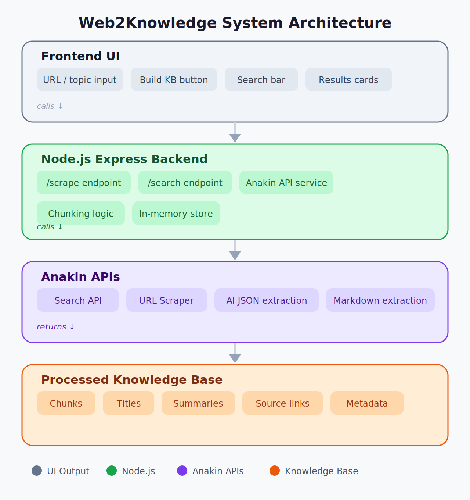
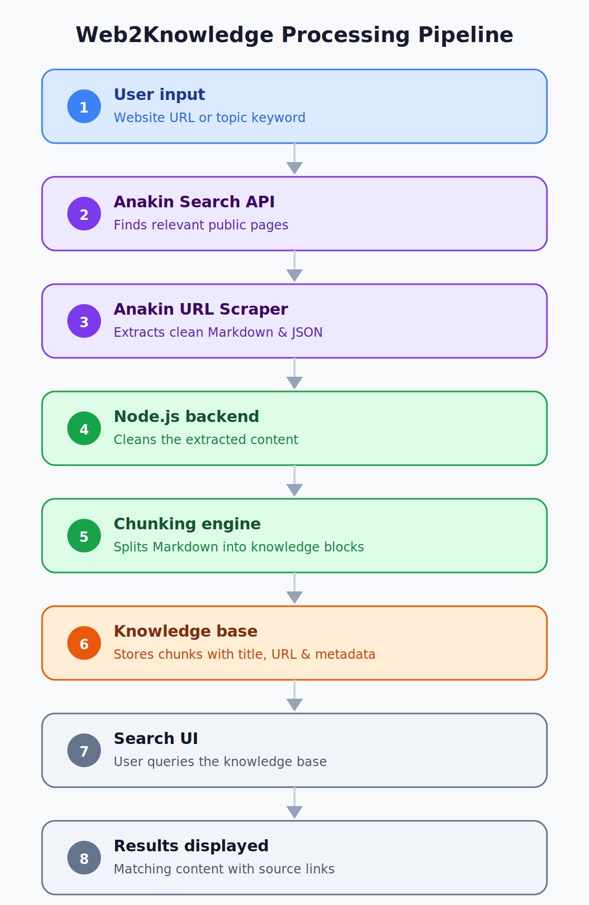
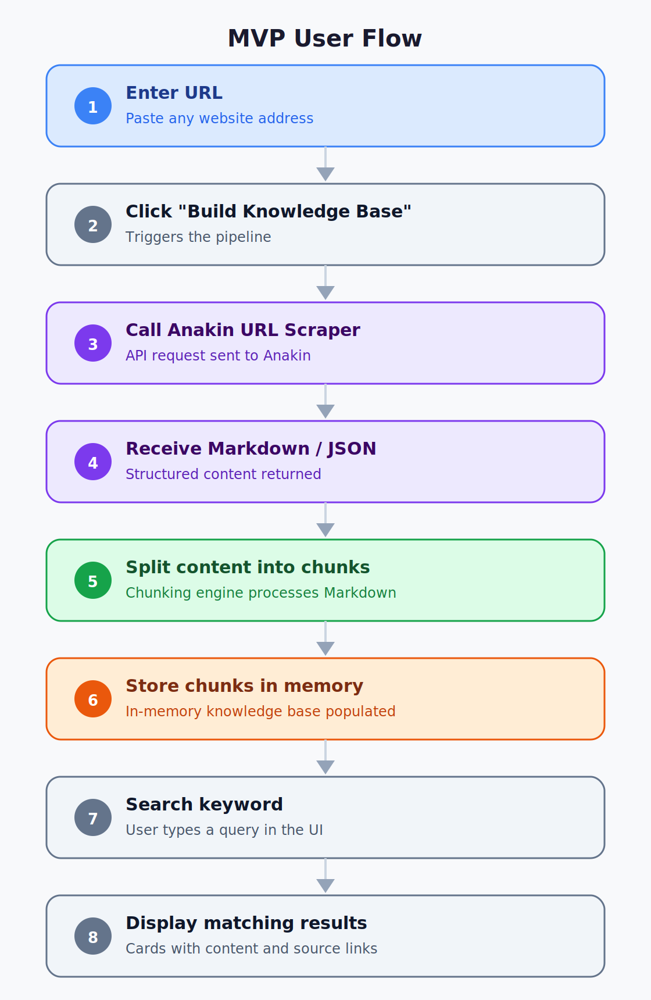

# Web2Knowledge — System Design

## System Overview

Web2Knowledge is designed as a lightweight, modular, AI-ready web intelligence pipeline that converts public websites into structured, searchable knowledge bases using Anakin APIs and a Node.js processing architecture.

The system focuses on:

* scalable content extraction
* AI-ready Markdown and JSON generation
* chunk-based knowledge processing
* searchable retrieval workflows
* rapid web-to-knowledge transformation

The architecture is intentionally designed to remain simple, extensible, and efficient while supporting future AI and semantic search integrations.

---

# High-Level Architecture

<p align="center">
  
</p>

---

# Core System Components

## 1. Frontend Interface

The frontend provides:

* website/topic input
* knowledge base generation controls
* search functionality
* results visualization
* export workflows

### Technologies

* HTML
* Tailwind CSS
* Vanilla JavaScript

### Responsibilities

* collect user input
* trigger backend API calls
* display progress and results
* provide searchable interaction

---

## 2. Backend API Layer

The backend is built using Node.js and Express.js.

### Responsibilities

* receive frontend requests
* manage scraping workflows
* process extracted content
* handle chunking logic
* serve searchable data

### Core Endpoints

#### `/scrape`

Triggers:

* Search API
* URL Scraper
* crawling workflows

#### `/search`

Searches generated knowledge chunks.

#### `/export`

Exports structured JSON datasets.

---

## 3. Anakin Integration Layer

The Anakin integration layer acts as the core extraction engine.

### URL Scraper

Used for:

* single URL scraping
* batch scraping
* Markdown extraction
* structured JSON generation

### Search API

Used for:

* intelligent source discovery
* topic-based retrieval
* relevant URL generation

### Crawl / Discovery Workflows

Used for:

* multi-page discovery
* automated documentation traversal

### AI Extraction

Used for:

* metadata extraction
* summaries
* titles
* headings
* structured fields

---

# Data Processing Pipeline

<p align="center">
  
</p>

---

# Content Processing Workflow

## Step 1 — Input Collection

User provides:

* website URL
  or
* topic/query

Example:

```text
https://nextjs.org/docs
```

---

## Step 2 — Source Discovery

If a topic is provided:

* Search API discovers relevant pages.

If a direct URL is provided:

* scraping begins immediately.

---

## Step 3 — Web Extraction

Anakin URL Scraper extracts:

* Markdown
* structured JSON
* metadata
* summaries
* headings

The system supports:

* single-page scraping
* batch scraping workflows

---

## Step 4 — Chunking Engine

Extracted Markdown is processed into smaller searchable chunks.

Chunking logic:

* split by headings
* split by sections
* maintain metadata association

Each chunk contains:

```json
{
  "title": "",
  "source": "",
  "content": "",
  "chunkIndex": 0
}
```

---

## Step 5 — Knowledge Base Generation

Processed chunks are stored in:

* in-memory arrays
  or
* lightweight JSON storage

This enables:

* rapid retrieval
* low-latency search
* lightweight execution

---

## Step 6 — Search & Retrieval

The frontend search engine:

* filters chunks
* retrieves relevant matches
* displays source references

The MVP uses:

* keyword-based retrieval
* lightweight search logic

---

# MVP System Flow

<p align="center">
  
</p>

---

# Search Workflow

```text
User Search Query
        ↓
Search Endpoint
        ↓
Chunk Matching
        ↓
Relevance Filtering
        ↓
Search Results
        ↓
Source References
```

---

# Storage Design

## MVP Storage

The MVP uses:

* in-memory storage
* lightweight JSON persistence

This approach:

* minimizes infrastructure overhead
* improves development speed
* supports rapid iteration

---

# Scalability Design

Future scalable architecture extensions include:

## Semantic Search

* vector embeddings
* similarity retrieval

## Vector Databases

* Pinecone
* Supabase pgvector
* LanceDB

## AI Integrations

* LangChain
* LlamaIndex
* RAG chat systems

## Scheduled Crawling

* recurring refresh workflows
* automated updates

## Multi-Source Intelligence

* aggregated research pipelines
* cross-site knowledge graphs

---

# Error Handling Strategy

The system includes:

* invalid URL validation
* scrape failure handling
* fallback extraction workflows
* empty-result handling
* request timeout protection

---

# Security & Reliability

The architecture leverages:

* Anakin proxy routing
* anti-detection workflows
* structured extraction APIs
* asynchronous scraping workflows

This improves:

* scraping reliability
* extraction consistency
* scalability across public websites

---

# Design Goals

The system is designed to achieve:

* fast execution
* modular architecture
* AI-ready data generation
* lightweight infrastructure
* scalable extensibility
* production-oriented workflows

---

# System Summary

Web2Knowledge combines Anakin’s scraping, search, crawling, and AI extraction capabilities with a lightweight Node.js processing architecture to create a scalable web intelligence pipeline capable of transforming unstructured public web content into searchable, structured, AI-ready knowledge systems.
