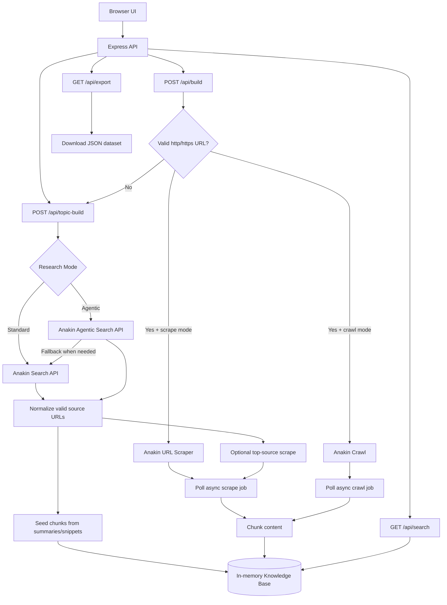
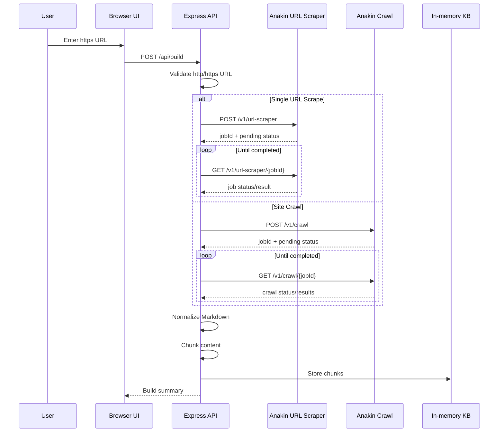
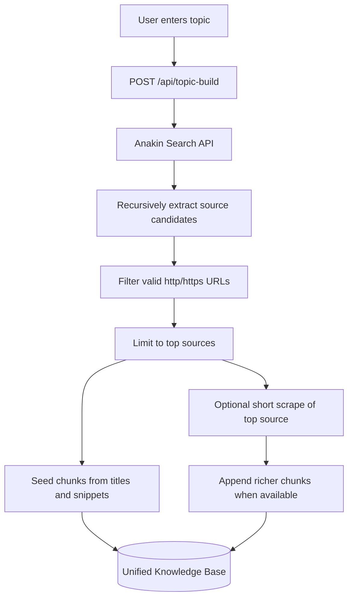
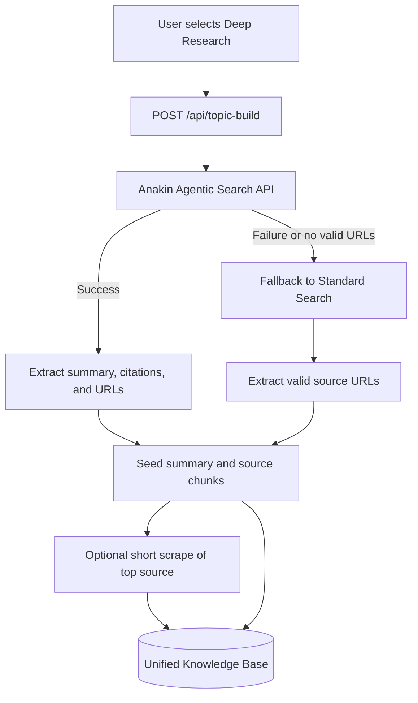

# Web2Knowledge - System Design

## System Overview

Web2Knowledge is a lightweight Express application that converts public web sources into an in-memory, searchable, downloadable knowledge base.

The architecture intentionally stays simple:

- Express backend.
- Plain HTML frontend.
- Tailwind CSS.
- Vanilla JavaScript.
- In-memory chunk store.
- Anakin APIs for search, agentic research, and URL scraping.
- Optional Anakin Crawl for limited multi-page extraction.

---

## High-Level Architecture



---

## Runtime Components

## 1. Frontend

File:

```text
public/index.html
```

Responsibilities:

- Accept URL or topic input.
- Let the user select URL or Topic Search.
- Let the user select Standard Search or Deep Research.
- Show pipeline status.
- Show discovered sources.
- Show research summaries when available.
- Search generated chunks.
- Download the current dataset.

Frontend technologies:

- HTML
- Tailwind CSS CDN
- Vanilla JavaScript

---

## 2. Backend

File:

```text
server.js
```

Responsibilities:

- Serve the static frontend.
- Route build requests.
- Validate URLs.
- Call Anakin Search, Agentic Search, and URL Scraper.
- Poll async scrape jobs through the utility layer.
- Chunk extracted or discovered content.
- Store chunks in memory.
- Serve search and export APIs.

---

## 3. Anakin Utility Layer

File:

```text
utils/anakin.js
```

Responsibilities:

- Add Anakin API headers.
- Validate API key presence.
- Call URL Scraper.
- Call Crawl for small multi-page URL extraction.
- Poll async URL Scraper jobs.
- Poll async Crawl jobs.
- Call Standard Search.
- Call Agentic Search.
- Normalize scrape responses.
- Return clear errors for auth, invalid URL, and timeouts.

---

## API Endpoints

## `GET /health`

Returns basic service status.

Response:

```json
{
  "status": "ok",
  "project": "Web2Knowledge"
}
```

---

## `POST /api/build`

Builds the knowledge base from direct URL input.

Behavior:

- If input is a valid `http` or `https` URL, use URL scraping.
- If input is plain text, auto-route to topic research.

Payload:

```json
{
  "input": "https://tailwindcss.com/docs",
  "mode": "url",
  "researchMode": "standard",
  "extractionMode": "crawl"
}
```

---

## `POST /api/topic-build`

Builds the knowledge base from a topic.

Behavior:

- `researchMode: "standard"` uses Anakin Search.
- `researchMode: "agentic"` tries Anakin Agentic Search first.
- Agentic failures fall back to Standard Search.
- Valid source URLs are extracted and filtered.
- Topic chunks are seeded from search summaries/snippets.
- The top source may be scraped for richer content with a short timeout.

Payload:

```json
{
  "input": "Next.js routing",
  "mode": "topic",
  "researchMode": "agentic"
}
```

---

## `GET /api/search`

Searches the current in-memory knowledge base.

Example:

```text
/api/search?q=tailwind
```

Search behavior:

- Keyword matching.
- Checks title, content, and source URL.
- Returns up to 20 matching chunks.

---

## `GET /api/export`

Downloads the current knowledge base as JSON.

Headers:

```text
Content-Type: application/json
Content-Disposition: attachment; filename="web2knowledge-dataset.json"
```

Structure:

```json
{
  "project": "Web2Knowledge",
  "generatedAt": "2026-05-10T00:00:00.000Z",
  "totalChunks": 0,
  "data": []
}
```

---

## Data Flow

## URL Mode



---

## Standard Topic Search



---

## Deep Research Mode



---

## Chunk Model

Each chunk follows this structure:

```json
{
  "id": "string",
  "title": "string",
  "source": "string",
  "content": "string",
  "chunkIndex": 0,
  "generatedJson": {}
}
```

The MVP stores these chunks in:

```js
let knowledgeBase = [];
```

---

## Error Handling

The system handles:

- Missing Anakin API key.
- Invalid URL input.
- Topic text accidentally sent through URL mode.
- Empty Anakin Search results.
- Agentic Search failure.
- Slow topic source scraping.
- Async scrape job timeout.
- Async crawl job timeout.

Important design choices:

- URL mode is strict because the user expects direct scraping.
- Topic mode is resilient because discovered web pages can be slow or noisy.
- Agentic Search has fallback to Standard Search.
- Topic builds can succeed even if some discovered sources fail.

---

## Test Coverage

The project includes a lightweight Node test suite.

Run:

```powershell
npm test
```

The tests avoid live Anakin calls and verify:

- Homepage route.
- Express health route.
- Export download headers and dataset shape.
- Exported chunk metadata.
- Request validation before Anakin calls.
- Topic request validation.
- Search endpoint behavior.
- URL validation.
- Chunk generation.
- Recursive source extraction and filtering.
- Citation extraction.
- Research summary normalization.

---

## Performance Strategy

To keep demos fast:

- Topic mode limits discovered URLs.
- Topic mode seeds chunks from search results immediately.
- Topic mode only attempts a short scrape of the top source.
- Slow topic scrapes are skipped.
- Direct URL mode keeps the full scrape behavior.
- Site Crawl mode is available when broader extraction matters more than speed.

---

## Security Notes

- API keys are loaded from `.env`.
- `.env` should not be committed.
- User input is escaped before rendering in the frontend.
- URL validation prevents non-HTTP schemes from reaching the scraper.

---

## Future System Extensions

- Persistent storage.
- Project history.
- Embeddings and semantic search.
- RAG chat over generated datasets.
- Background scrape queues.
- Source quality scoring.
- Multi-source deduplication.
- Scheduled refresh jobs.

---

## System Summary

Web2Knowledge uses Anakin APIs as the research and extraction engine, while the local Express app handles validation, fallback logic, chunking, search, and dataset export. The result is a simple but extensible AI research product that can transform URLs or topics into searchable knowledge in a demo-friendly workflow.
