# Web2Knowledge - System Design

## System Overview

Web2Knowledge is an Express application that converts public URLs and research topics into a persistent, searchable, exportable knowledge base.

The current architecture is intentionally lightweight but product-ready:

- Express backend.
- Static frontend served from `public/`.
- Local CSS and vanilla JavaScript.
- In-memory active dataset backed by SQLite persistence.
- Project history with multiple saved datasets.
- Anakin APIs for search, agentic research, scraping, and crawling.
- Local URL fetch fallback for direct URL extraction.
- Ranked local search and extractive ask flow.
- Source and chunk deduplication.
- Export presets for common RAG tools.

---

## High-Level Architecture



---

## Runtime Components

## 1. Frontend

Files:

```text
public/index.html
public/styles.css
public/app.js
```

Responsibilities:

- Render the product app shell.
- Let users build from URL or topic.
- Let users choose URL extraction, crawl, standard research, or deep research.
- Show saved dataset stats.
- Load saved chunks on page load.
- Provide top-level tabs for Build, Workspace, Ask, and Guide.
- Search chunks.
- Ask questions over the active dataset.
- Show Results, Sources, and Summary workspace tabs.
- Clear and export the dataset.
- Render the built-in user guide.

The frontend uses local CSS and does not depend on Tailwind CDN or a frontend build process.

---

## 2. Backend

File:

```text
server.js
```

Responsibilities:

- Serve static frontend assets.
- Validate inputs.
- Route URL builds and topic builds.
- Call the Anakin utility layer.
- Use local fallback extraction when direct URL scraping fails with a non-auth error.
- Chunk content by markdown-like structure.
- Maintain the active in-memory dataset.
- Persist chunks through the storage layer.
- Create a new project for each build.
- Activate saved projects into the current workspace.
- Rank search results.
- Build extractive answers with citations.
- Guard against unrelated low-confidence ask responses.
- Export and clear datasets.
- Format exports for Web2Knowledge, LangChain, LlamaIndex, Pinecone, Supabase, and LanceDB.

---

## 3. Anakin Utility Layer

File:

```text
utils/anakin.js
```

Responsibilities:

- Read Anakin API key from environment.
- Build Anakin request headers.
- Validate API key presence.
- Validate direct scrape URLs.
- Call URL Scraper.
- Call Crawl.
- Call Standard Search.
- Call Agentic Search.
- Poll async URL Scraper jobs.
- Poll async Crawl jobs.
- Poll async Agentic Search jobs.
- Normalize scraper/crawl responses.
- Return actionable errors for auth, endpoint, timeout, and API failures.

---

## 4. Storage Layer

File:

```text
utils/storage.js
```

Responsibilities:

- Create/open SQLite database.
- Create/read/update project records.
- Create the `chunks` table.
- Load saved chunks at server startup.
- Save the active dataset after mutations.
- Clear chunks.
- Activate saved projects.
- Close the database during tests.

Default database path:

```text
data/web2knowledge.sqlite
```

Tests can override this with:

```text
KB_DB_PATH
```

---

## API Endpoints

## `GET /health`

Returns:

```json
{
  "status": "ok",
  "project": "Web2Knowledge"
}
```

## `POST /api/build`

Builds from URL input. Plain text input is routed to topic mode.

Payload:

```json
{
  "input": "https://tailwindcss.com/docs",
  "mode": "url",
  "researchMode": "standard",
  "extractionMode": "scrape"
}
```

URL behavior:

- `extractionMode: "scrape"` uses Anakin URL Scraper.
- `extractionMode: "crawl"` uses Anakin Crawl.
- Non-auth URL scrape failures attempt local fetch fallback.
- Successful builds replace the active dataset.

## `POST /api/topic-build`

Builds from topic input.

Payload:

```json
{
  "input": "AI agents for software development",
  "mode": "topic",
  "researchMode": "agentic"
}
```

Topic behavior:

- Standard mode uses Anakin Search.
- Agentic mode uses Anakin Agentic Search first.
- Agentic timeout/failure/no URLs falls back to Standard Search.
- Sources are normalized, filtered to HTTP/HTTPS, deduped, and limited.
- Source metadata seeds initial chunks.
- The top discovered source is scraped with a short timeout.

## `GET /api/search`

Returns saved chunks when no query is provided:

```text
/api/search
```

Searches ranked chunks when a query is provided:

```text
/api/search?q=javascript
```

Search behavior:

- Tokenizes query and document text.
- Removes common stopwords.
- Applies light token normalization.
- Uses cosine-style token similarity.
- Adds boosts for exact query matches in title/content/source.
- Returns up to 20 results.

## `GET /api/projects`

Lists saved projects and the active project.

## `POST /api/projects/:id/activate`

Activates a saved project and reloads its chunks into the in-memory active dataset.

## `POST /api/ask`

Answers from the active dataset.

Payload:

```json
{
  "question": "What is JavaScript?"
}
```

Ask behavior:

- Retrieves top-ranked chunks.
- Extracts and ranks candidate sentences.
- Returns up to three citations.
- Returns a safe no-context answer when confidence is too low.

## `GET /api/export`

Downloads:

```text
web2knowledge-dataset.json
```

Supports:

- `format=langchain`
- `format=llamaindex`
- `format=pinecone`
- `format=supabase`
- `format=lancedb`

## `DELETE /api/dataset`

Clears the active dataset from memory and SQLite.

---

## Data Flow

## URL Mode



## Ask Flow



---

## Chunk Model

```json
{
  "id": "string",
  "title": "string",
  "source": "string",
  "content": "string",
  "chunkIndex": 0,
  "generatedJson": {}
}
```

---

## Error Handling

The system handles:

- Missing Anakin API key.
- Invalid URL input.
- Topic input accidentally submitted through URL build.
- Empty source discovery results.
- Agentic Search failure or timeout.
- Slow topic source scraping.
- URL Scraper job timeout.
- Crawl job timeout.
- Direct URL scrape non-auth failures through local fallback.
- Unrelated ask questions through a low-confidence guard.

---

## Test Coverage

Run:

```powershell
npm.cmd test
```

Current automated coverage: `26` tests.

The suite verifies:

- Homepage and static assets.
- Health route.
- Export route.
- Dataset clear route.
- Project history listing and activation.
- SQLite persistence.
- Export preset formatting.
- Request validation.
- Search behavior.
- Ask behavior.
- Unrelated question guard.
- URL validation.
- Markdown-aware chunking.
- Search result normalization.
- Canonical source deduplication.
- Citation and summary extraction.

---

## Security Notes

- `.env` is ignored by git.
- Anakin key is read server-side only.
- User-rendered content is escaped in the frontend.
- Only `http` and `https` URLs are accepted for scraping.
- Local fallback is skipped for auth errors so invalid API keys are not hidden.

---

## System Summary

Web2Knowledge uses Anakin as the discovery and extraction engine, then keeps the product workflow local and lightweight: Express routes, local static UI, SQLite persistence, ranked search, extractive ask, and exportable JSON. It is designed to be understandable, demo-friendly, and extensible without requiring a frontend framework or vector database in the current version.
